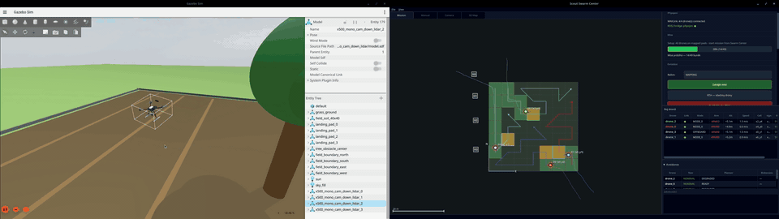
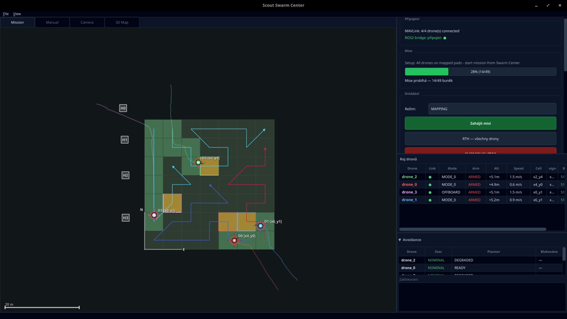
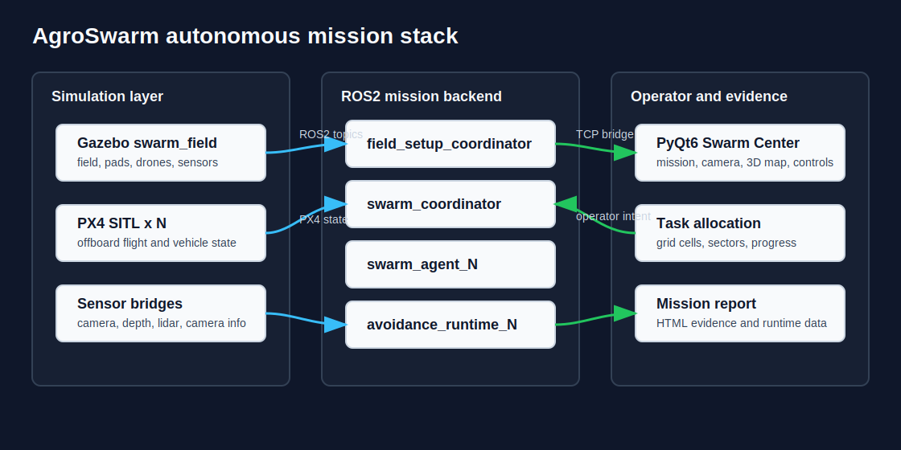

# AgroSwarm

AgroSwarm is a ROS2/PX4 autonomous agricultural drone swarm prototype that simulates multi-drone field mapping and spraying missions in Gazebo, with a custom PyQt6 ground control station, task allocation, obstacle avoidance, telemetry, and generated mission reports.

**[Demo video](#reports-and-video-evidence)** | **[Architecture](#architecture)** | **[Run instructions](#main-run-path)** | **[Current milestone](#current-milestone)** | **[Known limitations](#known-limitations)**



Status: Phase 1-5 / Phase 15 E2E mission milestone, tested successfully on 2026-05-02.

License: all rights reserved. This project is public for demonstration and
portfolio review only; see `LICENSE.md`.

## Why This Matters

This project explores how small autonomous drone teams could coordinate
agricultural inspection and spraying tasks before deployment on real hardware.
The current version focuses on simulation, operator workflow, swarm
coordination, and mission evidence generation.

AgroSwarm is built as a portfolio/research prototype around the full mission
loop: pad setup, field boundary capture, grid generation, mapping mission,
spraying phase, Swarm Center monitoring, obstacle avoidance runtime, and final
HTML report generation.

## Current Milestone

The latest end-to-end test was considered successful. The mission produced a
generated HTML report and public video evidence. Known non-blocking issues are
documented in `docs/test_pahes1-5/known_issues.md`.

Validated flow:

- Start PX4 SITL + Gazebo `swarm_field`.
- Start Micro XRCE-DDS and ROS2 workspace.
- Launch `scout_control full_e2e_mission.launch.py`.
- Use Swarm Center as the operator station.
- Capture pads and field boundary.
- Generate the field grid.
- Confirm and run the autonomous mapping/spraying mission.
- Track live swarm state in the PyQt Swarm Center.
- Generate an HTML report after mission completion.

## Architecture

Swarm Center is the PyQt6 ground control station used to monitor drone state,
field grid progress, mission mode, telemetry, and runtime warnings.



The mission stack combines PX4 SITL, Gazebo simulation, ROS2 mission logic,
sensor bridges, a ground control station, and generated report evidence.



## What Works Now

- Multi-drone PX4 SITL in Gazebo, currently designed for 1-4 drones.
- `swarm_field` world with staging spawns and operator-discovered pads.
- ROS2 Jazzy mission backend with one obstacle avoidance runtime per drone.
- Swarm Center PyQt6 ground station with MAVLink telemetry and ROS2 bridge.
- Manual setup from Swarm Center: arm/disarm, manual movement intents, pad
  marking, boundary points, grid generation, mission confirmation.
- Autonomous task allocation over generated grid cells.
- Per-drone mission delegation through `swarm_agent`.
- Runtime-owned PX4 offboard control through `obstacle_avoidance_runtime`.
- Downward lidar bridge, camera bridge, forward depth bridge, and camera info
  bridge from Gazebo to ROS2.
- Cell data recording into `cell_data/` during runtime.
- Simulated spraying log via `spray_controller`.
- Dummy ML/NDVI/anomaly/dose publisher for the current milestone.
- Swarm Center Mission, Camera, and 3D Map tabs.
- HTML report generation in `reports/<timestamp>/`.

## Known Limitations

The milestone is successful, but these issues are intentionally left for later:

- Some generated cell splitting looked unusual in the final E2E run.
- During the mapping mission, spraying occurred even though it should not have.
- Swarm Center route planning does not yet prevent drones from meeting each
  other, which can trigger unnecessary obstacle avoidance.
- Swarm Center 3D map and overlay did not show the field mapping state such as
  obstacles and mapping outputs.

See `docs/test_pahes1-5/known_issues.md`.

## Tech Stack

- ROS2 Jazzy, `rclpy`, `ament_python`, `ament_cmake`.
- PX4 SITL with Gazebo / gz-sim.
- Micro XRCE-DDS Agent for PX4 <-> ROS2 transport.
- `px4_msgs` submodule/messages.
- Custom `scout_control_msgs` typed ROS messages.
- `ros_gz_bridge` and `ros_gz_image` for lidar/camera/depth transport.
- Python 3 mission logic and launch tooling.
- PyQt6 Swarm Center desktop GCS.
- MAVLink / `pymavlink` for telemetry and arm/disarm operations.
- NumPy, Pillow, pyqtgraph, PyOpenGL for visualization/reporting support.

## Drone Sensor Stack

Current final E2E model:

- PX4/Gazebo model: `gz_x500_mono_cam_down_lidar`.
- Downward RGB camera bridged to `/drone_N/camera/image_raw`.
- Downward lidar bridged to `/drone_N/downward_lidar/scan` for range/terrain
  support.
- Forward depth camera bridged to `/drone_N/depth/image_raw`.
- Forward camera info bridged to `/drone_N/camera/camera_info`.
- PX4 local position, vehicle status, control mode, command ack, attitude,
  battery/system status, and heartbeat are consumed through PX4 ROS2 topics and
  MAVLink/Swarm Center telemetry.

In the current milestone, `obstacle_avoidance_runtime` owns navigation and
avoidance. Downward lidar is not treated as a horizontal obstacle source by
default; explicit obstacle scans must be configured separately through the
runtime lidar obstacle parameters described in `docs/topic_contract.md`.

## Repository Layout

```text
.
|-- scout_launcher.py              # interactive launcher for PX4/Gazebo/ROS2/Swarm Center
|-- isaac_launcher.py              # Isaac/Pegasus launcher path
|-- reset.sh                       # workspace cleanup helper
|-- src/
|   |-- scout_control/             # main ROS2 Python package
|   |-- scout_control_msgs/        # custom ROS2 messages
|   `-- px4_msgs/                  # PX4 message package
|-- swarm_center/                  # PyQt6 ground control station
|-- scenarios/                     # launcher scenario definitions
|-- worlds/                        # USD/USDA/overlay world assets
|-- perimeters/                    # source field assets and generated runtime state
|-- reports/                       # mission report documentation
|-- video/                         # release video documentation
`-- docs/                          # runbooks, topic contracts, known issues, plans
```

## Main Run Path

Recommended operator path:

```bash
cd scout_ws
python3 scout_launcher.py
```

Recommended launcher selections:

- launch mode: `swarm`
- world: `swarm_field`
- model: `gz_x500_mono_cam_down_lidar`
- scenario: Full E2E mission
- drone count: 1-4, final milestone path used 4-drone swarm support

The launcher handles the usual multi-terminal workflow:

- kills stale PX4/Gazebo/MicroXRCE processes,
- syncs the package world into the PX4 Gazebo world directory,
- writes runtime `perimeters/spawn_origins.json`,
- starts PX4 SITL instances,
- starts MicroXRCEAgent,
- starts QGroundControl when available,
- builds/sources the ROS2 workspace,
- launches the selected ROS2 scenario,
- opens Swarm Center.

## Manual Run Path

Build and source:

```bash
source /opt/ros/jazzy/setup.bash
colcon build --packages-select scout_control scout_control_msgs
source install/setup.bash
```

Start MicroXRCE:

```bash
MicroXRCEAgent udp4 -p 8888
```

Start PX4/Gazebo drone 0:

```bash
cd ~/PX4-Autopilot
PX4_GZ_WORLD=swarm_field \
PX4_GZ_MODEL_POSE='-26,-12,0,0,0,0' \
make px4_sitl gz_x500_mono_cam_down_lidar
```

Start additional PX4 instances from `~/PX4-Autopilot/build/px4_sitl_default`
with `PX4_GZ_STANDALONE=1`, `PX4_SIM_MODEL=gz_x500_mono_cam_down_lidar`, and
instance ids `-i 1`, `-i 2`, `-i 3`.

Start the E2E backend:

```bash
ros2 launch scout_control full_e2e_mission.launch.py \
  world:=swarm_field \
  model:=gz_x500_mono_cam_down_lidar \
  drone_count:=4 \
  cell_size_m:=5.0 \
  altitude:=5.0 \
  cruise_speed:=2.0
```

Start Swarm Center manually:

```bash
python3 swarm_center/main.py --drones 4
```

## Production E2E Nodes

`full_e2e_mission.launch.py` starts these production/backend nodes:

| Node executable | Launch name | Role |
| --- | --- | --- |
| `field_setup_coordinator` | `field_setup_coordinator` | Setup state machine: pads, boundary, grid, mission-ready gate. |
| `home_manager` | `home_manager` | Home pad/RTH registry and landing target coordination. |
| `manual_controller` | `manual_controller` | Swarm Center manual intent bridge; does not own PX4 setpoints. |
| `obstacle_avoidance_runtime` | `avoidance_runtime_N` | Per-drone flight owner: arm/takeoff/offboard setpoints, RTH, terrain following, local avoidance. |
| `swarm_agent` | `swarm_agent_N` | Per-drone mission delegate; receives cells and sends target commands to runtime. |
| `swarm_coordinator` | `swarm_coordinator` | Multi-drone grid assignment, task status, mission progress, rebalancing. |
| `cell_data_recorder` | `cell_data_recorder` | Saves per-cell images and metadata to runtime `cell_data/`. |
| `spray_controller` | `spray_controller` | Simulated spray events and `spray_log.json`. |
| `ml_interface` | `ml_interface` | Current dummy NDVI/anomaly/dose stream for AI overlay path. |
| `mission_launcher` | `mission_launcher` | Converts `/swarm/mission_ready` into `/swarm/start_mission`. |
| `gcs_bridge` | `gcs_bridge` | TCP bridge between ROS2 topics and Swarm Center. |
| `ros_gz_bridge` | `lidar_bridge_drone_N`, `depth_info_bridge_drone_N` | Gazebo lidar/camera-info bridge. |
| `ros_gz_image` | `camera_bridge_drone_N`, `depth_bridge_drone_N` | Gazebo image/depth bridge. |

Debug/manual/legacy PX4 setpoint controllers are intentionally excluded from
the production E2E launch. The runtime owner is `obstacle_avoidance_runtime`.

## ROS2 Console Scripts

The `scout_control` package exposes these console scripts:

- Core: `swarm_agent`, `swarm_coordinator`, `field_setup_coordinator`,
  `home_manager`, `mission_launcher`, `gcs_bridge`, `spray_controller`,
  `cell_data_recorder`, `ml_interface`, `obstacle_avoidance_runtime`,
  `mapping_mission`, `field_model_builder`, `precision_landing`.
- Utilities: `grid_generator`, `task_allocator`.
- Visualization: `camera_hud`, `obstacle_viz`, `gimbal_cam_viz`,
  `scan_cloud_viz`.
- Manual/setup tools: `field_setup_tool`, `manual_controller`,
  `legacy_manual_controller`.

## Important Topics

Human-readable topic contract: `docs/topic_contract.md`.

Key mission topics:

- `/field/setup_status`, `/field/setup_complete`, `/field/mission_confirm`
- `/field/boundary_point`, `/field/boundary_close`, `/field/generate_grid`
- `/swarm/mission_ready`, `/swarm/start_mission`, `/swarm/mission_complete`
- `/swarm/task_status`, `/swarm/drone_status`, `/swarm/mode`
- `/swarm/rth_request`, `/swarm/home_positions`, `/swarm/peer_cells`
- `/drone_N/avoidance/target_cmd`, `/drone_N/avoidance/status`
- `/drone_N/camera/image_raw`, `/drone_N/depth/image_raw`
- `/drone_N/downward_lidar/scan`

## Swarm Center

Swarm Center lives in `swarm_center/` and is a standalone PyQt6 GCS.

It connects to:

- MAVLink UDP ports `14540+` for PX4 telemetry and arm/disarm.
- ROS2 bridge TCP port `17845` through `gcs_bridge`.

Current UI areas:

- Mission tab: field grid, drone positions, setup controls, mission progress.
- Camera tab: per-drone image stream and stream controls.
- 3D Map tab: drone trails and field outline.
- Drone list: telemetry, assigned cells, status, context controls.
- Control panel: mode, progress, RTH/emergency actions.

## Runtime Outputs

These files and directories are generated per run and are intentionally not part
of the public source package:

- `build/`, `install/`, `log/`
- Python caches and test caches
- `cell_data/`
- `logs/avoidance_logs/`
- `spray_log.json`
- `perimeters/field_grid.json`
- `perimeters/field_boundary.json`
- `perimeters/home_positions.json`
- `perimeters/spawn_origins.json`
- timestamped `reports/<timestamp>/`
- video binaries under `video/`

## Reports And Video Evidence

The final E2E report was generated under this runtime path during validation:

```text
reports/20260502T094157Z/report.html
```

Timestamped report folders are runtime artifacts and are not part of normal
source commits. The repository keeps `reports/README.md` as the stable
documentation entry point.

Mission videos are published as GitHub Release assets rather than normal Git
files.

Published video assets:

- `video/manual_maping.mp4`
- `video/auto_maping_mission.mp4`

Published release:

- [Phase 1-5 E2E Mission Milestone](https://github.com/Thomeras/AgroSwarm/releases/tag/phase-1-5-e2e-milestone)
- [manual_maping.mp4](https://github.com/Thomeras/AgroSwarm/releases/download/phase-1-5-e2e-milestone/manual_maping.mp4)
- [auto_maping_mission.mp4](https://github.com/Thomeras/AgroSwarm/releases/download/phase-1-5-e2e-milestone/auto_maping_mission.mp4)

### Manual Mapping Setup

Manual mapping setup test driven from Swarm Center controls. The operator uses
the GCS to control the drone during field setup, mark landing pads, capture the
field boundary, and prepare the generated grid for the later autonomous mission.

<video controls src="https://github.com/Thomeras/AgroSwarm/releases/download/phase-1-5-e2e-milestone/manual_maping.mp4" title="Manual mapping setup through Swarm Center controls"></video>

Fallback link: [manual_maping.mp4](https://github.com/Thomeras/AgroSwarm/releases/download/phase-1-5-e2e-milestone/manual_maping.mp4)

### Autonomous Mapping Mission

Autonomous mapping mission evidence. After the setup phase, the swarm mission
backend takes over: cells are assigned, drones execute mapped routes through the
current `obstacle_avoidance_runtime` flight owner, Swarm Center tracks progress,
and the mission produces report data.

<video controls src="https://github.com/Thomeras/AgroSwarm/releases/download/phase-1-5-e2e-milestone/auto_maping_mission.mp4" title="Autonomous mapping mission"></video>

Fallback link: [auto_maping_mission.mp4](https://github.com/Thomeras/AgroSwarm/releases/download/phase-1-5-e2e-milestone/auto_maping_mission.mp4)

## Documentation

- `docs/launch_files/phase15_Ndrone_e2e_runbook.txt` - final N-drone runbook.
- `docs/guides/E2E_OPERATOR_GUIDE.md` - operator guide.
- `docs/topic_contract.md` - ROS2 topic contract.
- `docs/test_pahes1-5/known_issues.md` - final milestone known issues.
- `scenarios/README.md` - current vs legacy scenario policy.
- `swarm_center/README.md` - Swarm Center architecture and operation notes.

## License

This project is not open source. All rights are reserved by the project owner.
The repository is public for demonstration, review, and portfolio purposes only.
Do not copy, redistribute, commercialize, or create derivative works without
prior written permission. See `LICENSE.md`.

## Legacy Policy

Legacy launch scenarios and legacy nodes are archive/reference material, not the
current production path. They should stay out of the final E2E launch unless
revalidated against the current topic contract.

Keep for now:

- historical scenario definitions for isolated diagnostics and regression work.
- `src/scout_control/scout_control/legacy/` for reference implementations.
- older Isaac/Phase 1-3 runbooks for historical context.

Candidate cleanup after the milestone:

- remove legacy nodes that are no longer imported, launched, or useful for
  comparison,
- promote only re-tested scenarios back to `scenarios/`,
- move useful logic from legacy modules into current `core/`, `avoidance/`,
  `mapping/`, or `vision/` modules with tests.

## Final Milestone Notes

This commit is intended as the first final push milestone for the Phase 1-5 E2E
project state. The project is ready to be presented as a working autonomous
swarm prototype with documented runtime limitations and public mission evidence.
